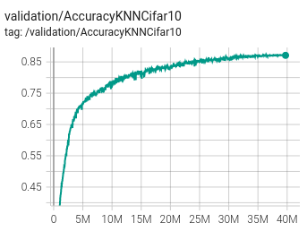
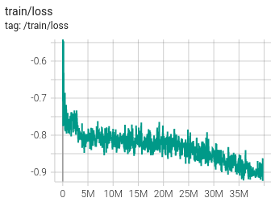

# PytorchToolsAndTutorials

This repository contains helpful tools and tutorials related to PyTorch.

Features:  
- Slurm environement
- SimSiam Reproduction 87.336% acc CIFAR10 KNN, linear probing asap

- TODO : Step/epoch scheduler : cosin + warmup no wd on 1d params  
- TODO : How to train on multiples nodes/gpu
- TODO : repro : Clean code I-JEPA
- TODO : models : add layers and basics models (transformers, etc.)
- TODO : Patch masking with transformers (layer and collate)
- TODO : Folder Dataset