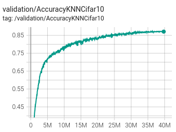
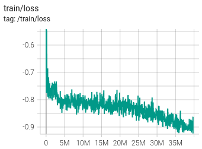

# SimSiam reproduction

## hparams

| Hparam    |  value | 
|----------:|--------|
|    base_lr|    0.03|
|         wd|  0.0005|
|      epoch|     800|
| batch_size|     512|
|   pred_dim|     512|
|    emb_dim|    2048|
|   momentum|     0.9|
|   img_size|      32|
|      knn_k|     200|
|      knn_t|     0.1|
|       crop| (0.2;1)|

CIFAR10 resnet18 version (3x3 first conv)
zero init BN residual

